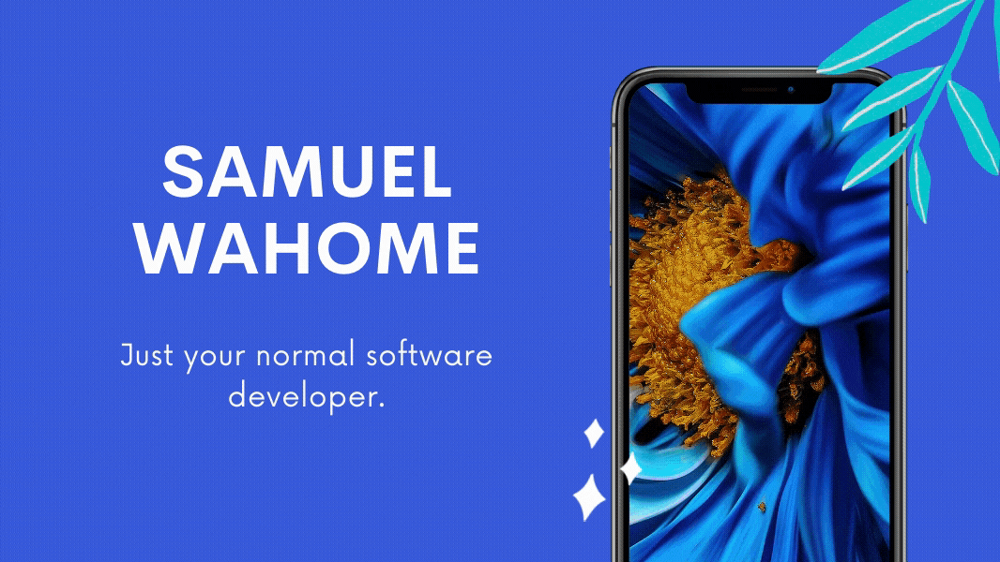

<!--  -->

&nbsp;&nbsp;
&nbsp;&nbsp;

# Hi there, folks! 
My name is Samuel Wahome, and I'm a software developer, who is interested in all things code and tech, always curious and always learning.:technologist::computer::kenya:🥇

## TOOLS AND TECHNOLOGIES:wrench::hammer_and_pick:

<!--
**Samuel-dot-cloud/Samuel-dot-cloud** is a ✨ _special_ ✨ repository because its `README.md` (this file) appears on your GitHub profile.

Here are some ideas to get you started:

- 🔭 I’m currently working on ...
- 🌱 I’m currently learning ...
- 👯 I’m looking to collaborate on ...
- 🤔 I’m looking for help with ...
- 💬 Ask me about ...
- 📫 How to reach me: ...
- 😄 Pronouns: ...
- ⚡ Fun fact: ...
-->
